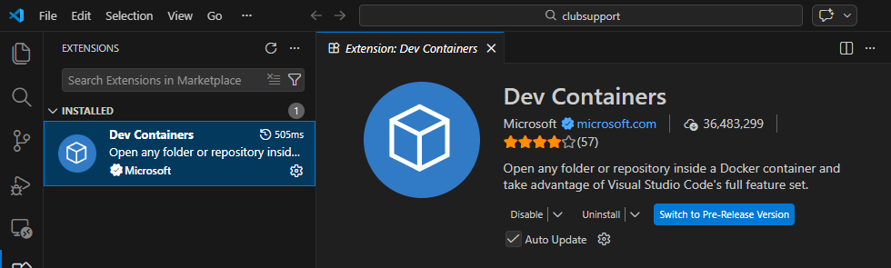
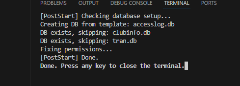
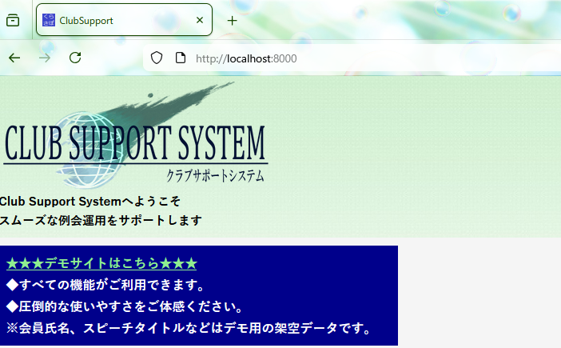
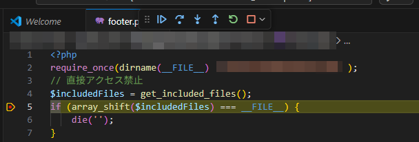
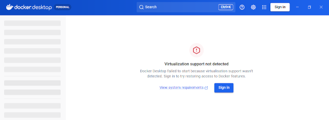
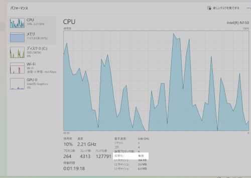
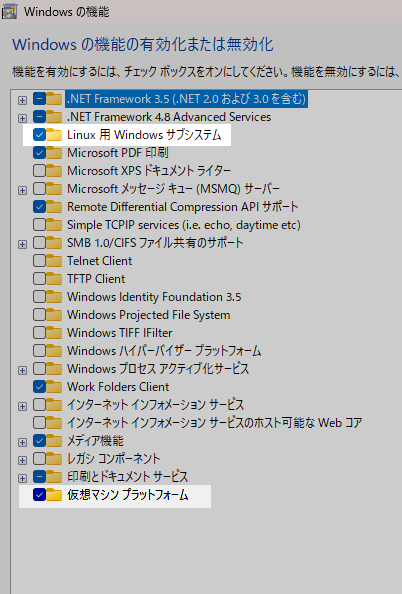
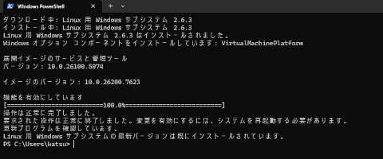

# デバッグ環境構築手順

## 1. ソフトウェアのインストール
以下のツールを順にインストールしてください[^1]。

1. [Visual Studio Code (VSCode)](https://code.visualstudio.com/)

    * Linuxの場合はSnap/Flatpak版ではなく、公式サイトまたはディストリビューション公式のリポジトリからインストールすることを推奨します。
    1. [Dev Containers (VSCode拡張機能)](https://marketplace.visualstudio.com/items?itemName=ms-vscode-remote.remote-containers)
        * VSCodeインストール後、リンク先またはVSCode内のマーケットプレイスから追加します。
        
        
        * 派生VSCodeは、この拡張機能との相性問題があります。
1. [Docker Desktop](https://www.docker.com/products/docker-desktop/) / Docker Engine
    * Windows / Mac: Docker Desktopをインストールします。
    * Linux: Docker CE (Server版) のRootlessモード、またはDocker Desktopを推奨します。
    * Chromebook: Docker CEをインストールし、ユーザをdockerグループに追加してRootfulモードで使用します（Rootlessだと名前解決に問題が出る場合があるため）。
1. [Git](https://git-scm.com/)
    * 各OSに合わせてインストールします。

[^1]: 動作確認バージョン。VSCode Version: 1.108.2。Dev Containers: v0.442.0。Docker API Version: 1.51。

## 2. リポジトリのクローン手順

※本プロジェクトはプライベートリポジトリです。アクセス権限を持つメンバーのみ取得可能です。以下の方法でクローンしてください。

1. Githubアカウントを登録する。
1. [クラブサポートシステムの保守・開発チーム](https://groups.google.com/g/tmc_club_support)に **グループ参加をリクエスト** してください。
1. グループにメンバー追加されたら返信が来ます。
1. 返信内容に書かれているリポジトリをクローンしてください。

## 3. データベースバックアップファイル取得・移動
Googleグループの共有ディレクトリ`clubsupport`から *tmc_clubsup-*.sql* のファイルをダウンロードしてください。

gitクローンしたフォルダ内(例: `ホームディレクトリ/git/clubsupport/`)に移動してください。  

## 4. コンテナのビルドと起動
1. Dockerを起動します。
1. VSCodeを起動します。
1. VSCodeのコマンドパレットを開きます。
1. `Dev Containers: Rebuild and Reopen in Container` を実行します。
    * キャッシュの問題でビルドが反映されない場合は、コンテナ削除や `docker builder prune` を検討してください。
1. `[PostStart] Done.`と**TERMINAL**に表示されたら起動が成功しています。

## 5. データベースバックアップのインポート

1. ターミナルを開きます。
1. `mysql -h db -u tmc_clubsupport -p --skip-ssl < tmc_clubsup-YYYY-mm-DD_番号.sql`
1. パスワードを入力

**データベースのコンテナを削除**しない限り、データは保持されます。二回目からは不要です。

## 6. デバッグの実行
1. PHPのソースコードにブレークポイント（停止位置）を設定します。
1. デバッグ実行(F5)を開始し、ブラウザから http://localhost:8000 へアクセスします。

    

    

    各クラブの画面に行くには、普段のクラブサポートシステムのURLの`https://サポートシステムのドメイン/クラブ識別子/`のクラブ識別子を付けて`http://localhost:8000/クラブ識別子/`として下さい。

### トラブルシューティング

WindowsでDocker Desktopを起動すると`Virtualization support not detected`と表示される。

1. BIOS/UEFIで仮想化が有効になっているか、確認する。

    タスクマネージャーのパフォーマンスタブにあるCPUの右下の情報エリアにある仮想化という項目を確認してください。

    

1. Windowsの機能の有効化または無効化で、以下の項目にチェックが入ってるか、確認する。

    - [x] Linux 用 Windows サブシステム (Windows Subsystem for Linux)
    - [x] 仮想マシン プラットフォーム (Virtual Machine Platform)
        
    

1. WSLを起動したことがない、もしくは古い。

    1. ターミナルか、PowerShellを管理者権限で起動する。
    1. `wsl --update`のコマンドを実行する。

    
    
## 📖 ナレッジ
詳細な仕様を確認したい方は[Wiki](./wiki.md) をご確認ください。
